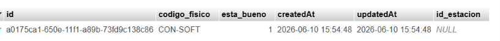
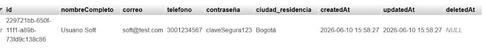
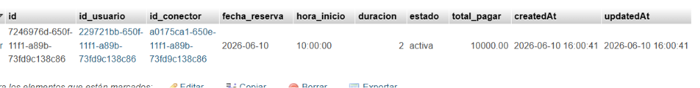
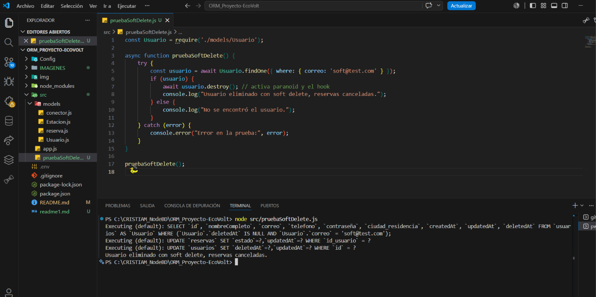
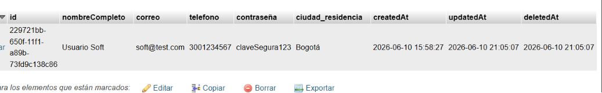
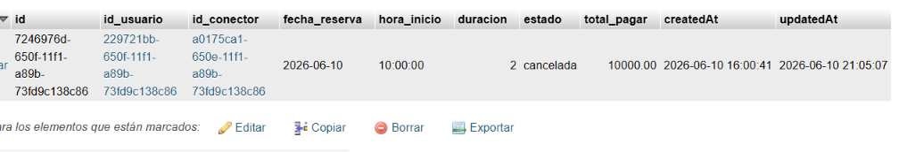
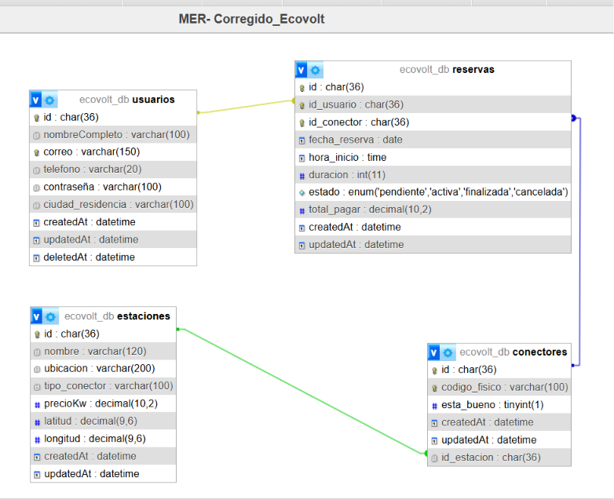

# Correcciones realizadas en EcoVolt

---

## 1. Integridad Referencial y Soft Delete (No cumplía inicialmente)

### Lo que se pedía
Definir qué sucede con las reservas activas cuando un usuario elimina su cuenta utilizando `paranoid: true`.

### Lo que estaba mal
- Se agregó `paranoid: true` al modelo `Usuario`, pero en `app.js` la relación se configuró con `onDelete: 'RESTRICT'`.  
- Sequelize, al utilizar `paranoid`, no ejecuta un `DELETE` físico en la base de datos, sino un `UPDATE` que llena el campo `deletedAt`.  
- Por esta razón, no se ejecutaba la lógica esperada para las reservas asociadas.

### Corrección implementada
```javascript
// Modelo Usuario con paranoid
const Usuario = sequelize.define('Usuario', {
    nombreCompleto: DataTypes.STRING,
    correo: DataTypes.STRING,
    // otros atributos...
}, {
    paranoid: true // habilita soft delete
});

// Hook para actualizar reservas activas a canceladas
Usuario.addHook('beforeDestroy', async (usuario, options) => {
    await Reserva.update(
        { estado: 'cancelada' },
        { where: { id_usuario: usuario.id, estado: 'activa' } }
    );
});

// Relación Usuario ↔ Reserva
Usuario.hasMany(Reserva, {
    foreignKey: { name: 'id_usuario', allowNull: false },
    onDelete: 'CASCADE',
    onUpdate: 'CASCADE'
});

Reserva.belongsTo(Usuario, {
    foreignKey: { name: 'id_usuario', allowNull: false },
    onDelete: 'CASCADE',
    onUpdate: 'CASCADE'
});
```

### Resultado

Al eliminar un usuario, sus reservas activas cambian automáticamente al estado **cancelada**, conservando la trazabilidad de la información y evitando inconsistencias en el sistema.

**Prueba realizada:**
  1. Se creó un usuario y un conector con una reserva activa.
    
    
    

2. Se eliminó el usuario con Sequelize (`usuario.destroy()`).  
    

    Tabla `usuarios` mostrando el campo `deletedAt` lleno (soft delete aplicado). 
    

    En la Tabla `reservas` la reserva pasó de **activa** a **cancelada** automáticamente. 
    

---

## 2. Relación Muchos a Muchos y Tabla Intermedia (No cumplía inicialmente)

### Lo que se pedía

Implementar una relación **Muchos a Muchos (M:N)** entre `Usuario` y `Conector` mediante la tabla intermedia `Reserva`, incluyendo los siguientes atributos:

* `fecha_reserva`
* `hora_inicio`
* `estado`
* `total_pagar`

### Lo que estaba mal

* Se relacionó `Reserva` con `Estacion` en lugar de `Conector`.
* Se omitió el campo `total_pagar`.
* No se utilizó `belongsToMany`, rompiendo la relación M:N requerida.

### Corrección implementada

```javascript
// Relación M:N Usuario ↔ Conector vía Reserva
Usuario.belongsToMany(Conector, {
    through: Reserva,
    foreignKey: 'id_usuario'
});

Conector.belongsToMany(Usuario, {
    through: Reserva,
    foreignKey: 'id_conector'
});

// Modelo Reserva con atributos completos
const Reserva = sequelize.define('Reserva', {
    fecha_reserva: {
        type: DataTypes.DATEONLY,
        allowNull: false
    },
    hora_inicio: {
        type: DataTypes.TIME,
        allowNull: false
    },
    duracion: {
        type: DataTypes.INTEGER,
        allowNull: false
    },
    estado: {
        type: DataTypes.ENUM(
            'pendiente',
            'activa',
            'finalizada',
            'cancelada'
        ),
        defaultValue: 'pendiente'
    },
    total_pagar: {
        type: DataTypes.DECIMAL(10,2),
        allowNull: false
    }
});
```

### Resultado

La tabla **Reserva** conecta correctamente  **Usuario** y **Conector**, además almacena la información financiera  (total_pagar) de cada reserva.

---

## 3. Modelo Entidad Relación (MER)

### Diagrama actualizado




