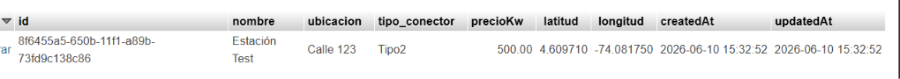
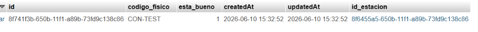
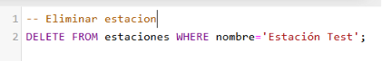
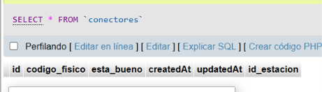
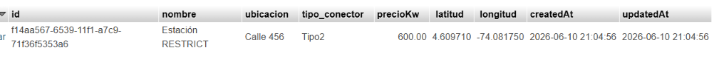
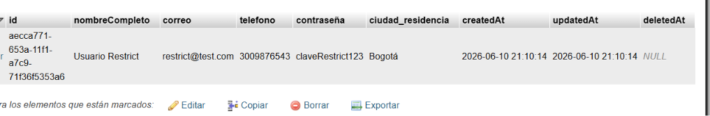
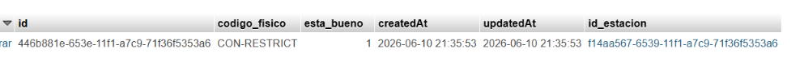
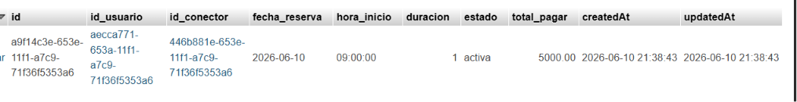
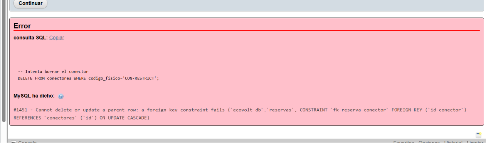

# 1. Mapear todas las relaciones

En el modelo de datos de **EcoVolt** se definieron las siguientes relaciones entre las entidades:

- **Usuario ↔ Conector (M:N) vía Reserva**  
  Un usuario puede reservar distintos conectores y un conector puede ser reservado por distintos usuarios.  
  Esta relación se implementa mediante la tabla intermedia **Reserva**, que además almacena atributos propios como `fecha_reserva`, `hora_inicio`, `duracion`, `estado` y `total_pagar`.

- **Estación ↔ Conector (1:N)**  
  Una estación de carga puede tener múltiples conectores asociados.  
  Si se elimina una estación, sus conectores también se eliminan (`onDelete: CASCADE`).

- **Usuario ↔ Reserva (1:N)**  
  Un usuario puede tener múltiples reservas registradas en el sistema.  
  Esto permite mantener el historial de uso de cada usuario.

- **Conector ↔ Reserva (1:N)**  
  Un conector puede estar asociado a múltiples reservas en distintos momentos.  
  Esto refleja la disponibilidad y uso histórico de cada conector.


# 2. Justificación de los borrados onDelete

En el sistema EcoVolt se definieron las siguientes reglas de borrado para mantener la integridad referencial:

- **Estación → Conectores (CASCADE)**  
  Si se elimina una estación, todos sus conectores asociados también se eliminan automáticamente.  
  Esto evita que queden conectores sin estación.

  Estacion.hasMany(Conector, {
      foreignKey: { name: 'id_estacion', allowNull: false },
      onDelete: 'CASCADE',
      onUpdate: 'CASCADE'
  });

  Conector.belongsTo(Estacion, {
      foreignKey: { name: 'id_estacion', allowNull: false },
      onDelete: 'CASCADE',
      onUpdate: 'CASCADE'
  });

  Al tener una relación 1:N, el CASCADE borra automáticamente los conectores relacionados cuando se elimina la estación.

  **Prueba realizada:**

1. Se creó una estación con un conector asociado.  
   
   

2. Se eliminó la estación
  

  El conector desaparecio automaticamente porque estaba relacionado a la estacion
  
  

- **Usuario → Reserva (Soft Delete con paranoid + hook)**  
  Cuando un usuario elimina su cuenta, no se borran sus reservas.  
  En su lugar, gracias al `paranoid: true` y al hook `beforeDestroy`, las reservas activas se actualizan a estado **cancelada**.  
  Esto conserva el historial y la trazabilidad del sistema.

  const Usuario = sequelize.define('Usuario', {
      // atributos...
  }, {
      paranoid: true // habilita soft delete
  });

  Usuario.addHook('beforeDestroy', async (usuario, options) => {
      await Reserva.update(
          { estado: 'cancelada' },
          { where: { id_usuario: usuario.id, estado: 'activa' } }
      );
  });

  Usuario.hasMany(Reserva, {
      foreignKey: { name: 'id_usuario', allowNull: false },
      onDelete: 'CASCADE',
      onUpdate: 'CASCADE'
  });

  Reserva.belongsTo(Usuario, {
      foreignKey: { name: 'id_usuario', allowNull: false },
      onDelete: 'CASCADE',
      onUpdate: 'CASCADE'
  });

  El paranoid evita el borrado físico y el hook actualiza las reservas activas a cancelada.

  **Prueba realizada:**
  1. Se creó un usuario y un conector con una reserva activa.
    
    
    

  2. Se eliminó el usuario con Sequelize (`usuario.destroy()`).  
    

    Tabla `usuarios` mostrando el campo `deletedAt` lleno (soft delete aplicado). 
    

    En la Tabla `reservas` la reserva pasó de **activa** a **cancelada** automáticamente. 
    


- **Conector → Reserva (RESTRICT)**  
  No se permite borrar un conector si está asociado a reservas.  
  Esto garantiza que el historial de reservas no se pierda.

  Conector.hasMany(Reserva, {
      foreignKey: { name: 'id_conector', allowNull: false },
      onDelete: 'RESTRICT',
      onUpdate: 'CASCADE'
  });

  Reserva.belongsTo(Conector, {
      foreignKey: { name: 'id_conector', allowNull: false },
      onDelete: 'RESTRICT',
      onUpdate: 'CASCADE'
  });

  El RESTRICT impide borrar un conector si tiene reservas asociadas, mostrando un error de MySQL.

  **Prueba realizada:**
  1. Se creó un usuario y una estación previamente. 
    
  

  2. Se creó un conector asociado a la estación. 
  

  3. Se creó una reserva asociada al usuario y al conector.
  

  4. Se intentó borrar el conector desde phpMyAdmin.  

  El sistema arrojó un error de MySQL indicando que no se puede eliminar porque está referenciado en la tabla `reservas`.  

  


# 3. Tablas intermedias

En el modelo de datos de **EcoVolt** se definió la tabla intermedia **Reserva** para implementar la relación M:N entre **Usuario** y **Conector**.  

La tabla `reservas` no solo conecta ambas entidades, sino que también almacena atributos propios de la reserva:

- `fecha_reserva`  
- `hora_inicio`  
- `duracion`  
- `estado`  
- `total_pagar`

**Código Sequelize:**
```js
const Reserva = sequelize.define('Reserva', {
    fecha_reserva: { type: DataTypes.DATEONLY, allowNull: false },
    hora_inicio: { type: DataTypes.TIME, allowNull: false },
    duracion: { type: DataTypes.INTEGER, allowNull: false },
    estado: { type: DataTypes.ENUM('pendiente','activa','finalizada','cancelada'), defaultValue: 'pendiente' },
    total_pagar: { type: DataTypes.DECIMAL(10,2), allowNull: false }
});

---

# 4. Modelo visual de las tablas

Modelo entidad-relación (MER) del sistema **EcoVolt**, con las tablas y sus relaciones:

- **Usuario** (1:N) → **Reserva**  
- **Conector** (1:N) → **Reserva**  
- **Usuario** (M:N) ↔ **Conector** vía **Reserva**  
- **Estación** (1:N) → **Conector**


