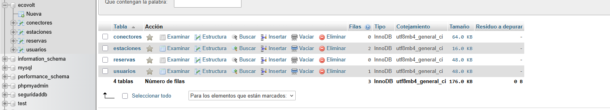

# Proyecto EcoVolt - Implementación Sequelize

## Descripción

Este proyecto consiste en la traducción del MER del sistema EcoVolt a Sequelize utilizando Node.js y MySQL.

Se implementaron modelos, relaciones, validaciones e integridad referencial según los requerimientos planteados en la actividad.


# Modelos implementados

## Usuario

Modelo encargado de gestionar los usuarios del sistema.

Características implementadas:

- UUID como llave primaria
- correo único
- timestamps automáticos
- Soft Delete con `paranoid: true`

---

## Estacion

Modelo encargado de representar las estaciones de carga.

Campos principales:

- nombre
- ubicacion
- tipo_conector
- precioKw
- latitud
- longitud

### Validaciones implementadas

## Precio por kW

Se validó el precio para evitar valores inconsistentes.

```js
validate: {
   min: 100,
   max: 5000
}
```

## Coordenadas geográficas

Se validaron rangos aproximados válidos para Colombia.

### Latitud

```txt
-4° <= latitud <= 13°
```

### Longitud

```txt
-79° <= longitud <= -66°
```

---

## Conector

Modelo encargado de representar los conectores físicos de cada estación.

Características:

- código físico único
- estado del conector
- relación con Estacion

---

## Reserva

Modelo encargado de gestionar las reservas realizadas por los usuarios.

Campos principales:

- fecha_reserva
- hora_inicio
- duracion
- estado

Estados implementados:

- pendiente
- activa
- finalizada
- cancelada

---

# Relaciones implementadas

## Usuario → Reserva

Un usuario puede realizar múltiples reservas.

```js
Usuario.hasMany(Reserva)
Reserva.belongsTo(Usuario)
```

---

## Estacion → Reserva

Una estación puede tener múltiples reservas.

```js
Estacion.hasMany(Reserva)
Reserva.belongsTo(Estacion)
```

---

## Estacion → Conector

Una estación puede tener múltiples conectores.

```js
Estacion.hasMany(Conector)
Conector.belongsTo(Estacion)
```

---

# Integridad referencial

Se implementaron restricciones para mantener la consistencia de los datos.

```js
onDelete: 'RESTRICT'
onUpdate: 'CASCADE'
```

### Explicación

- `RESTRICT` evita eliminar registros relacionados.
- `CASCADE` actualiza relaciones automáticamente.

---

# Soft Delete

Se implementó Soft Delete en el modelo Usuario utilizando:

```js
paranoid: true
```

Cuando un usuario elimina su cuenta:

- no se eliminan las reservas
- se conserva el historial
- se mantiene la trazabilidad del sistema

---

# Sincronización de modelos

Se utilizó:

```js
sequelize.sync({ alter: true })
```

Esto permite actualizar automáticamente la estructura de la base de datos según los modelos definidos.

---
# Pruebas realizadas

Se realizaron pruebas de conexión y funcionamiento utilizando MySQL y Sequelize.

## Resultados obtenidos

- conexión exitosa con MySQL
- creación automática de tablas mediante Sequelize
- creación correcta de claves foráneas
- validación de integridad referencial
- funcionamiento de relaciones entre modelos
- funcionamiento de Soft Delete mediante `deletedAt`

## Evidencias verificadas
## Tablas creadas automáticamente


### Integridad referencial

Al intentar crear una reserva con IDs inexistentes, MySQL bloqueó la operación mediante Foreign Keys.

### Soft Delete

Al eliminar un usuario mediante Sequelize, el registro no se eliminó físicamente, sino que se actualizó el campo `deletedAt`.
## usuario eliminado error


### Sincronización automática

Sequelize generó automáticamente las tablas:

- usuarios
- estaciones
- reservas
- conectores